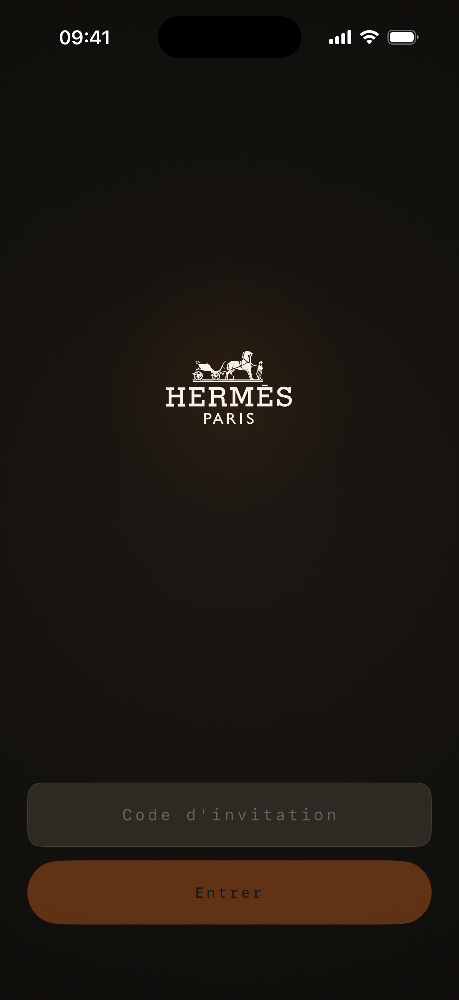
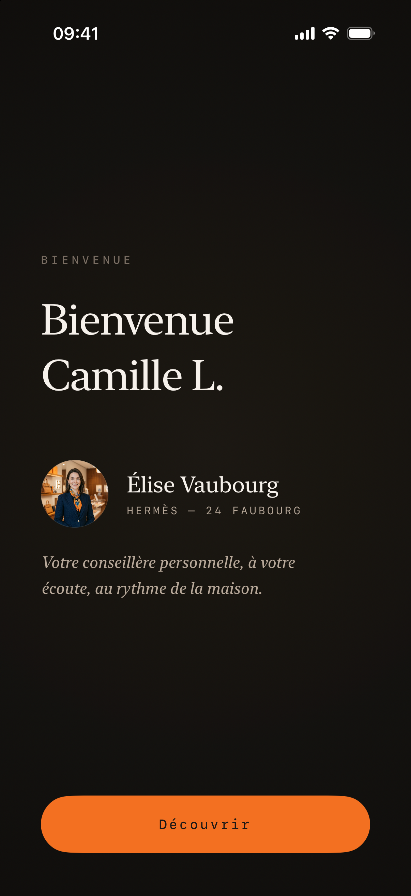
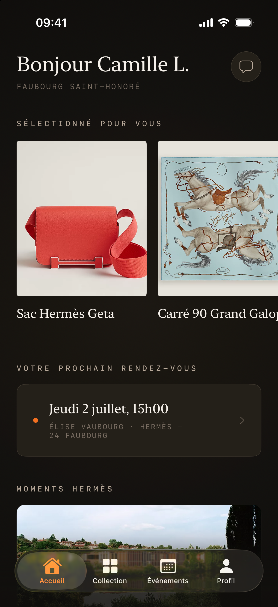
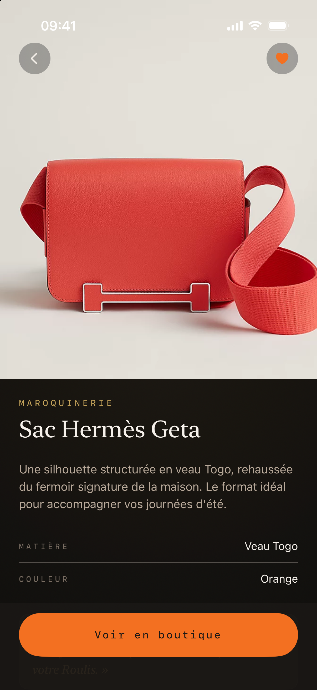
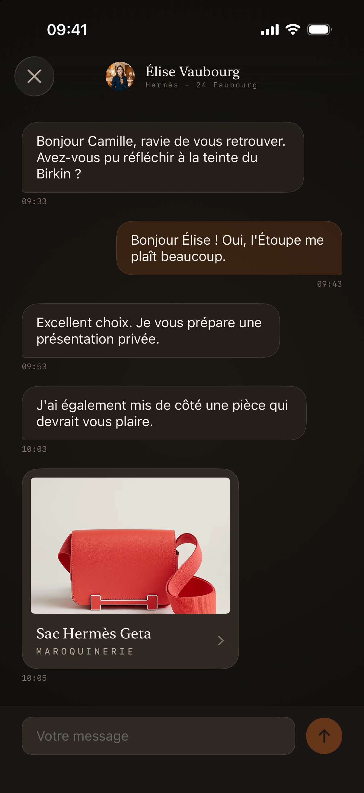
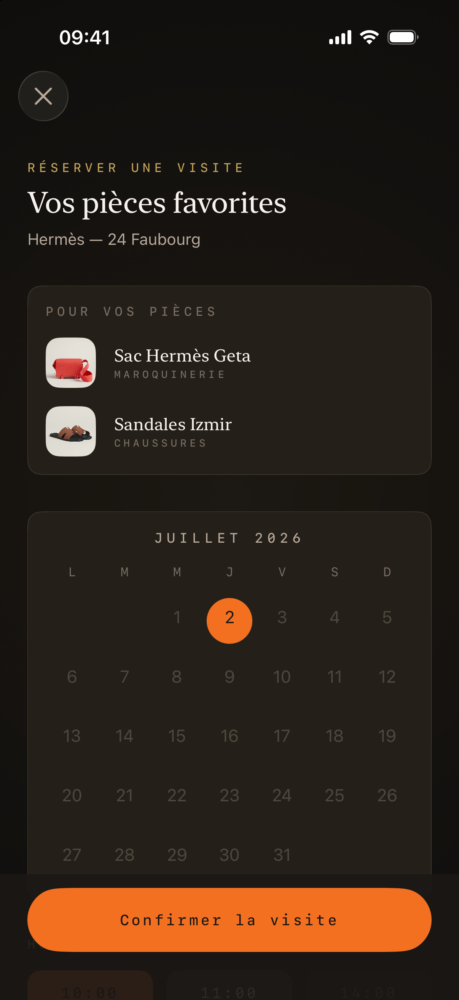
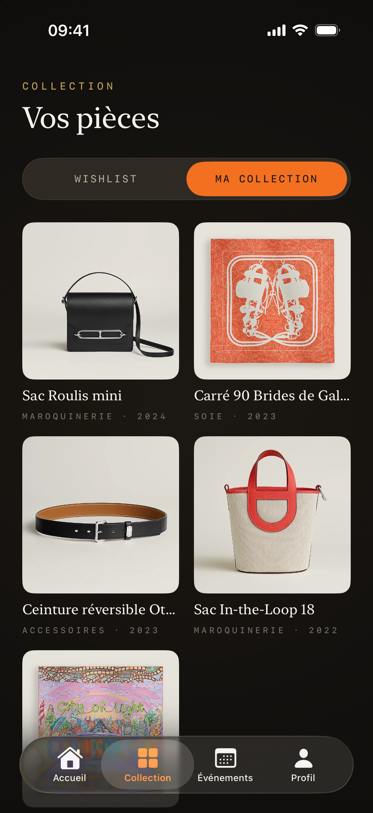
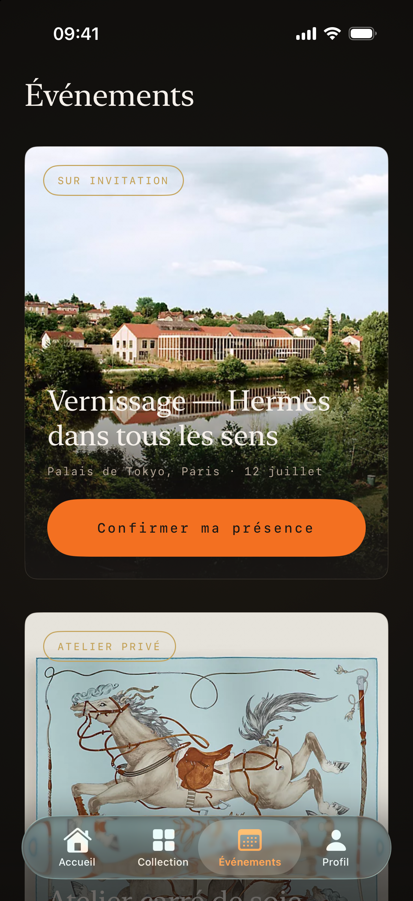
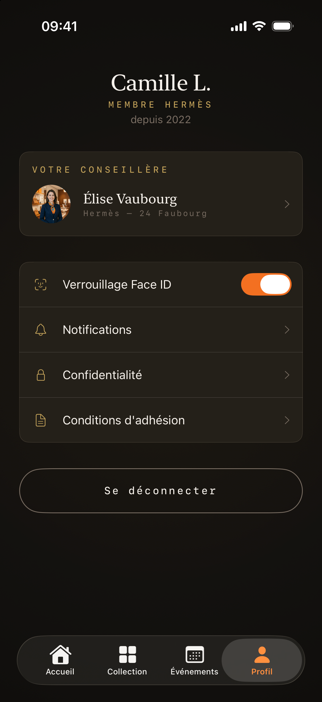

# Hermès VIP Concept

> **Disclaimer:** This is a non-commercial concept project created for portfolio purposes. It is not affiliated with, endorsed by, or connected to Hermès International. All trademarks belong to their respective owners.

An iOS 26 concept app: an invitation-only luxury concierge experience ("HERMÈS PARIS", Cercle VIP). Built in SwiftUI with a warm near-black dark-mode interface. The architecture is layered, with an async repository stack that swaps between a mock and a live backend and reactive `@Observable` UI. UI copy is in French.

## Architecture

- **UI**: SwiftUI, dark-mode only, `@Observable` view models, `@Environment` injection
- **Async UI state**: every screen exposes `AsyncUIState<T>` (idle / loading / data / error); the reusable `AsyncStateView` renders each case
- **Networking**: `APIClient` protocol (async, throws, `Decodable`); `URLSession`-shaped `Endpoint`, ISO-8601 `JSONDecoder`/`JSONEncoder`
- **Transport**: `MockAPIClient` serves bundled JSON fixtures (with in-code fallbacks), artificial latency and optional failure injection; an actor-backed `MockStore` keeps mutations (favorites, sent messages, bookings) stateful. The single DI seam swaps it for a `URLSessionAPIClient` against `APIConfig.baseURL`
- **DI**: hand-rolled `Factory<T>` primitive (shaped like hmlongco/Factory: `Container.shared.x()`, `.singleton()`, `.register`); `AppContainer.shared` is the single composition root, bridged into SwiftUI via `@Entry`
- **State machine**: `AppStateManager` (`@Observable`) drives the root phase: splash, onboarding, welcome, locked, authenticated
- **Security**: `BiometricAuthenticator` (LocalAuthentication) gates a resumed session behind Face ID / Touch ID
- **System**: `CalendarService` (EventKit) adds confirmed events to the device calendar
- **Persistence**: `UserDefaults` for the demo session and biometric-lock flag (no backend)
- **Testing**: XCTest target with repository/client stubs

### Layer breakdown

```
Features   Screen + ViewModel per vertical slice
Domain     Entities, Repository protocols
Data       DTOs, Repository impls, Mock transport
Core       Theme, Components, Networking, DI, Security
```

`Features` depends on `Domain`; `Data` implements `Domain` over `Core`.

## Screens

The app is a 10-screen flow (all French UI):

1. **Code d'invitation**: invitation-code entry (sun-emblem splash)
2. **Bienvenue**: welcome and personal advisor intro
3. **Accueil** (tab): curated products, next appointment, editorial "Moments"
4. **Détail produit**: product detail and advisor's note
5. **Conversation**: chat with the personal advisor (full-screen)
6. **Réserver une visite**: booking with a month calendar and time-slot chips (full-screen)
7. **Confirmation**: animated checkmark
8. **Collection** (tab): saved pieces and owned items
9. **Événements** (tab): private events catalog and souvenirs
10. **Profil** (tab): profile, Face ID toggle, sign out

The authenticated experience is a 4-tab `TabView` (Accueil / Collection / Événements / Profil). Booking and conversation are presented as full-screen covers via coordinators.

## Getting started

```bash
# Open in Xcode
open hermes-vip-concept.xcodeproj

# Build for the simulator
xcodebuild -scheme hermes-vip-concept \
  -destination 'platform=iOS Simulator,name=iPhone 16 Pro' build

# Run the test target
xcodebuild test -project hermes-vip-concept.xcodeproj \
  -scheme hermes-vip-concept \
  -destination 'platform=iOS Simulator,name=iPhone 16 Pro'
```

Requires **Xcode 26+** and the **iOS 26** SDK (deployment target 26.5). No third-party dependencies, no SPM or CocoaPods.

## Highlights

- Layered architecture (Features / Domain / Data / Core) with protocol-bound repositories
- Transport seam: mock and live backend swap via a single `AppContainer` registration
- Actor-isolated mock store so the offline demo keeps a stateful session
- `@Observable` and `AsyncUIState` UI with a shared loading/error renderer
- Face ID / Touch ID session lock (LocalAuthentication) and EventKit calendar integration
- Bundled image resolution with in-memory cache (`ProductImageStore`)
- XCTest coverage: `HomeViewModelTests`, `InvitationViewModelTests`, `DTOMappingTests`, `EndpointTests`

## Screenshots

| **Code d'invitation** | **Bienvenue** | **Accueil** |
|:---:|:---:|:---:|
|  |  |  |
| **Détail produit** | **Conversation** | **Réserver une visite** |
|  |  |  |
| **Collection** | **Événements** | **Profil** |
|  |  |  |
